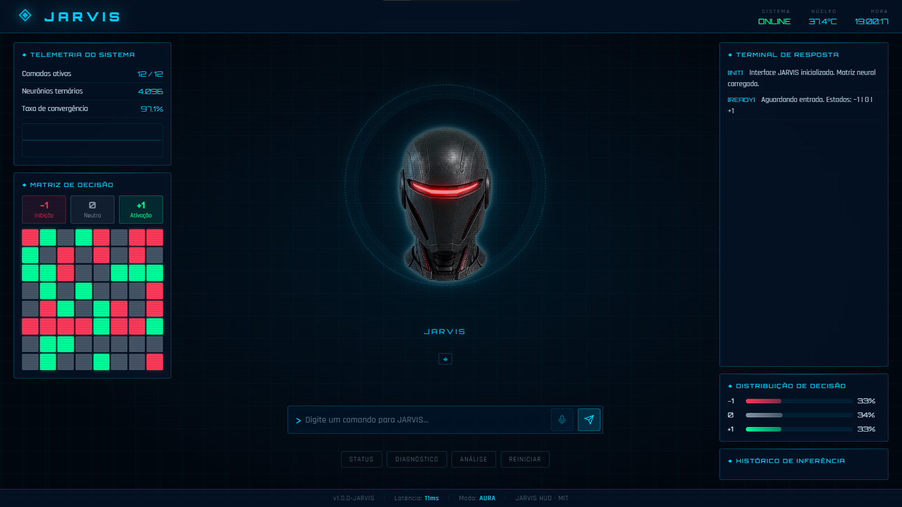
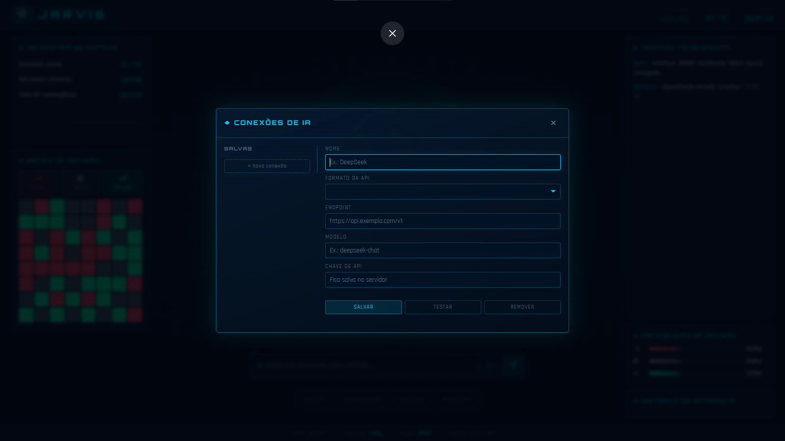

# MODELO-JARVIS

Assistente local para Windows que executa o **Qwen3.5-4B** na GPU, com interface
HUD, conversa por texto e voz, ferramentas controladas para arquivos e pesquisa
web com fontes. O projeto mantém tudo que é sensível na máquina local: modelo,
runtime, histórico operacional, gravações temporárias e chaves de API não são
versionados.

## Apresentação

<p align="center">
  
</p>

<p align="center">
  
</p>

## O que o modelo faz

O núcleo de linguagem é um arquivo GGUF quantizado do **Qwen3.5-4B**. A
configuração padrão espera o arquivo
`models/Qwen_Qwen3.5-4B-Q4_K_M.gguf` e o executa com `llama-server` (llama.cpp
com Vulkan) em `http://127.0.0.1:8080`.

`Q4_K_M` identifica uma quantização de baixo número de bits: ela reduz consumo de
memória e espaço em relação aos pesos completos, mantendo o modelo utilizável em
uma GPU local. O JARVIS não treina o Qwen durante a conversa e não envia as
perguntas do usuário para um serviço de IA por padrão.

O nome histórico `tern` também está presente no projeto por causa de experimentos
com vetores ternários (`-1`, `0`, `+1`). Esses experimentos são módulos separados;
o assistente principal usa o Qwen GGUF quantizado configurado no ambiente.

## Como uma pergunta vira resposta

```text
texto, microfone ou HUD web
        │
        ▼
Supervisor Python ──► políticas de decisão e segurança
        │
        ├── resposta direta ──► Qwen3.5 via llama-server local
        │
        └── ferramenta necessária
              ├── arquivos dentro das raízes autorizadas
              ├── pesquisa web, abertura e extração de fontes
              ├── sessão compartilhada do Codex
              └── consulta opcional ao DeepSeek
        │
        ▼
resposta textual completa ──► tela, terminal ou síntese de voz
```

O `RuntimeManager` verifica a saúde e a configuração do `llama-server` antes de
reutilizá-lo. Ele não troca nem encerra um servidor externo sem uma ação explícita.
O cliente local fala com a API compatível com OpenAI do `llama-server` em
`/v1/chat/completions`. Quando o modelo solicita uma ferramenta, o Python valida
os argumentos e aplica as regras antes de qualquer operação ser executada.

## Recursos

- Qwen3.5-4B local em GGUF, com GPU via Vulkan quando disponível.
- Interface HUD web e desktop, com avatar, telemetria e rotação fluida da cabeça.
- CLI `jarvis` para iniciar a interface, conversar, consultar status e diagnosticar
  o ambiente.
- Voz local: STT com faster-whisper e TTS Windows SAPI; Piper pode atuar como
  fallback.
- Pesquisa web com classificação de intenção, limites de rede, validação de fontes
  e citações.
- Acesso a arquivos limitado a diretórios autorizados; ações sensíveis exigem
  confirmação.
- Integração opcional com Codex e DeepSeek, mantendo estado e credenciais locais.

## Instalação no Windows

Requisitos básicos:

- Python 3.9 ou superior.
- Um `llama-server` compatível (o caminho pode ser configurado).
- O arquivo GGUF do Qwen3.5-4B, obtido separadamente e colocado em `models/`.

```powershell
git clone https://github.com/mucamuca/MODELO-JARVIS.git
Set-Location MODELO-JARVIS

py -m venv .venv
.\.venv\Scripts\Activate.ps1
python -m pip install --upgrade pip
python -m pip install -e ".[voice]"

Copy-Item .env.example .env
```

Edite `.env` apenas se seus caminhos forem diferentes dos padrões:

```dotenv
LOCAL_MODEL_PATH=C:\caminho\para\Qwen_Qwen3.5-4B-Q4_K_M.gguf
LOCAL_MODEL_RUNTIME=C:\caminho\para\llama-server.exe
```

Os pesos do Qwen, os binários de runtime, caches e modelos de voz grandes são
ignorados pelo Git. Isso evita subir arquivos acima do limite do GitHub e mantém o
repositório focado em código e configuração reproduzível.

## Executar

```powershell
# Inicia ou reutiliza o servidor local do Qwen
jarvis start

# Abre a interface HUD no navegador
jarvis

# Envia uma pergunta pelo terminal
jarvis ask "Explique como funciona a quantização Q4_K_M."

# Mostra o modelo, endpoint e parâmetros em uso
jarvis status
```

A interface web também pode ser iniciada diretamente:

```powershell
Set-Location interface
.\run_web.bat
```

## Voz

O fluxo de voz usa o mesmo supervisor da conversa por texto:

```text
microfone → faster-whisper (CPU/int8) → Supervisor → Qwen/ferramentas
         → resposta textual → Windows SAPI (Daniel pt-BR) ou Piper
```

Para diagnosticar dispositivos e modelos locais:

```powershell
jarvis voice-devices
jarvis voice-configure
jarvis voice-model-info
jarvis voice-diagnose
```

## Configuração e segurança

- `.env` não é enviado ao Git; use `.env.example` como referência.
- Chaves de pesquisa web, Codex e DeepSeek são opcionais e permanecem na máquina.
- A pesquisa web é feita pelo processo Python, não pelo modelo diretamente.
- Caminhos de arquivo são validados contra uma allowlist.
- Operações destrutivas e mudanças relevantes pedem confirmação.

Documentação complementar está em [`docs/`](docs/), incluindo voz, pesquisa web,
Codex, DeepSeek, gerenciamento de arquivos e decisões do agente.

## Estrutura principal

```text
interface/             HUD web, desktop e servidor local da interface
tern/orchestrator/     supervisor, runtime, ferramentas e políticas
tern/file_management/  operações locais de arquivos com persistência
models/voice/          configurações leves dos modelos de voz
docs/                  documentação técnica e relatórios
tests/                 testes automatizados
```

## Testes

```powershell
python -m pytest -q
```

## Licença

O código da interface está sob [MIT](interface/LICENSE). Bibliotecas, modelos e
vozes baixados separadamente mantêm suas próprias licenças.

## Autoria

- [Murilo Roque (@mucamuca)](https://github.com/mucamuca)
- [PrK (@PrK071)](https://github.com/PrK071)
